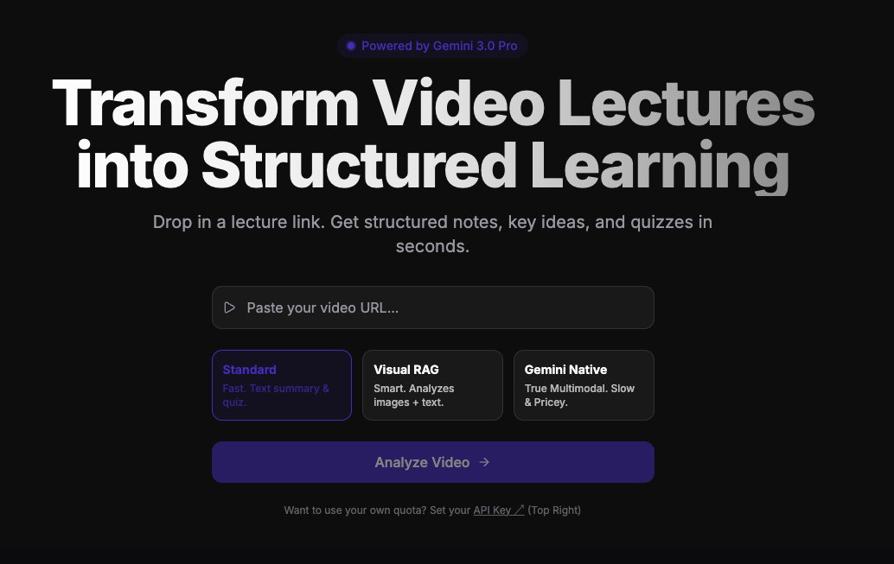
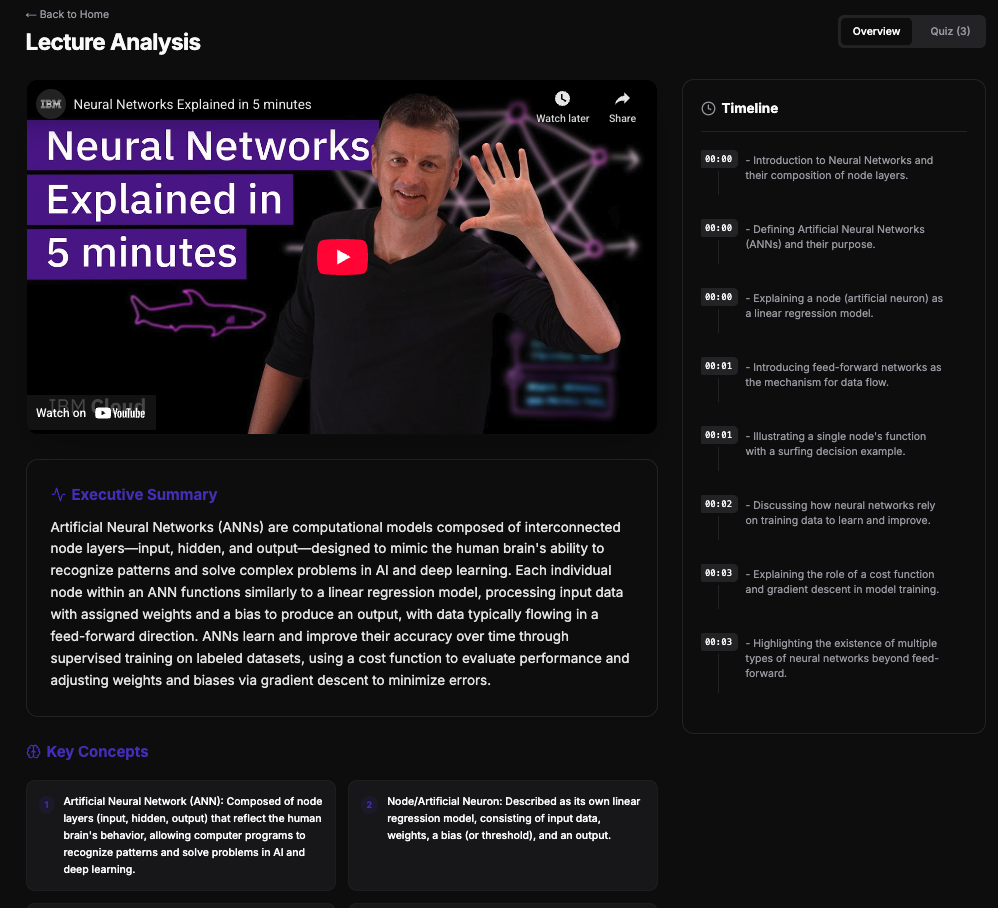
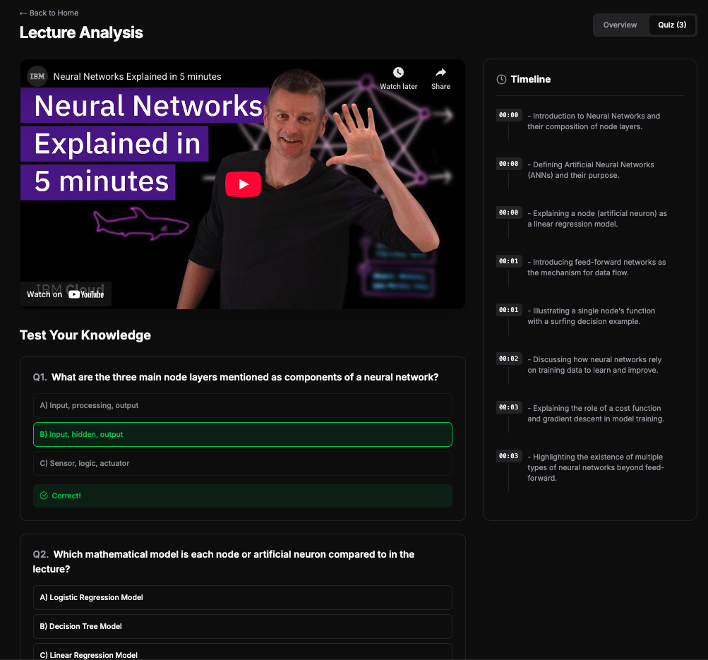

# Gemini Video Lecturer 🎓
**Multimodal AI Agent for Video Analysis**

Homepage

Overview

Quiz

## 🚀 Live Demo
**Try it here:** [http://34.57.223.153:3000/](http://34.57.223.153:3000/)

> **Note:** For heavy analysis (long videos or Native Multimodal mode), please enter your own **Gemini API Key** in the `Settings` (Top Right). The public quota is limited.

---

## 💡 The Problem
Standard video analysis tools are either:
1.  **Text-only**: They summarize transcripts but miss visual context (whiteboards, graphs, code).
2.  **Too Expensive**: Sending full video to frontier models (Gemini 1.5 Pro) costs ~$0.50+ per query.

## 🧠 The Solution: Hybrid Intelligence Architecture
This project implements a **tiered agentic system** that balances reasoning depth with production costs.

*   **Mode 1: Standard (Text-Only)**
    *   *Cost:* <$0.01
    *   *Latency:* ~2s
    *   *Use Case:* Summaries, textual Q&A.
*   **Mode 2: Visual RAG (Graphon)**
    *   *Cost:* Moderate
    *   *Use Case:* Retrieving specific visual slides without processing the whole video.
*   **Mode 3: Native Multimodal (Gemini 3.0 Pro)**
    *   *Cost:* High
    *   *Use Case:* Complex visual reasoning (e.g., "Explain the diagram at 10:05").

## 🛠️ Tech Stack
*   **Frontend**: Next.js 14, TailwindCSS, Framer Motion
*   **Backend**: Python FastAPI, Async Task Queues
*   **AI**: Google Gemini 2.5/3.0, Graphon (Visual Embeddings)
*   **Infrastructure**: Docker, Google Cloud Compute Engine (GCP)

## 📊 Evaluation
Built with a custom **LLM-as-a-Judge** evaluation pipeline that proved the Hybrid Strategy reduces inference costs by **90%** compared to naive multimodal approaches.
